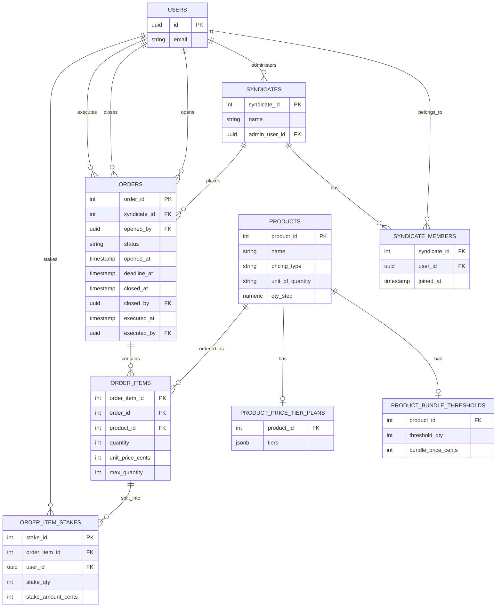

# Project context: syndicate purchase-coordination platform (PostgreSQL)

The ERD below is source of truth for table/column structure. `supabase/migrations/` is source of truth for exact SQL. The "Constraints, triggers & views" section only documents behavior the ERD can't express — don't let it drift into a second copy of column definitions. If an implementation decision depends on one of the open questions, flag it rather than guessing.

## Goal
Design a PostgreSQL schema for a syndicate purchase-coordination platform — **not a retailer**. The platform lets syndicates (member groups) pool stakes toward bulk purchases of external products. It does not sell, stock, ship, or fulfill anything itself, and it does not process payment — its job is coordinating who's committed to what and for how much, tracked as a ledger that members settle outside the app. Two pricing models exist: fixed-price bundles requiring a minimum number of distinct buyers, and per-unit tiered pricing with an optional supply ceiling.

## Key decisions
- The platform is a coordination/ledger layer, not a retailer. `products` represents the external item being pooled for, not inventory the platform owns.
- Primary account entity is Supabase `auth.users` — wired directly, no local `public.users`/profiles shadow table. Every FK to a person (`admin_user_id`, `opened_by`, `closed_by`, `executed_by`, `order_item_stakes.user_id`) is `UUID REFERENCES auth.users(id)`.
- Orders belong to syndicates, never directly to individual users. A solo buyer is a syndicate of one.
- `products.pricing_type` discriminates `threshold_bundle` (fixed pack price, requires N distinct buyers where N = pack size) vs `tiered` (sliding per-unit price by cumulative quantity).
- Threshold config lives in a 1-to-0/1 table (`product_bundle_thresholds`). Tiered config lives in a 1-to-0/1 table with a JSONB plan (`product_price_tier_plans`).
- `order_item_stakes` splits one `order_items` row's quantity across syndicate members. `stake_amount_cents` is a **pure ledger figure** — no payment processing in-app, members settle externally. Stored (not derived from `stake_qty × unit_price_cents`) since cent-rounding on indivisible bundle splits can make it diverge.
- **All money columns are `INTEGER` cents, never `NUMERIC`/decimal** (`product_bundle_thresholds.bundle_price_cents`, `product_price_tier_plans.tiers` JSONB values, `order_items.unit_price_cents`, `order_item_stakes.stake_amount_cents`) — eliminates floating point and keeps every price an exact whole-cent integer end to end.
- Rounding: work in integer cents, `floor(total_cents / n)` per member, distribute leftover cents by a deterministic rule (rule TBD — see open questions). Never use floating point for money.
- Each syndicate has exactly one admin (`syndicates.admin_user_id`), who opens orders and sets `deadline_at`.
- **`orders.status` has three states: `open` → `closed` → `executed`, strictly forward, no skipping.** An order closes either automatically (deadline job) or manually (admin action, recorded via `closed_by`). An order is marked `executed` by an admin once payment has been made externally (`executed_by`/`executed_at`) — this is a pure audit flag with no effect on item resolution logic beyond what `closed` already triggers.
- `order_items` has no stored `status`. Resolution is derived, and **now resolves early, per item, independent of the parent order's status**: a threshold item resolves the instant `quantity` hits `threshold_qty`; a tiered item with a `max_quantity` set resolves the instant `quantity` hits it. Only items that haven't hit a cap wait for the order to close.
- **Threshold items are hard-capped at exactly `threshold_qty`** — a stake that would push `quantity` past it is rejected outright (not clamped). No new column needed; enforced entirely by trigger, since the cap value lives on a different table (`product_bundle_thresholds`).
- **Tiered items may optionally carry a per-order-item supply cap** — `order_items.max_quantity` (nullable). `NULL` = uncapped, unchanged default behavior. Deliberately per-item only, no product-level default: admin sets it when creating the item, and can raise or lower it during the open window with a plain `UPDATE` (this also covers "the vendor's available supply just changed," no separate mechanism needed). A stake that would exceed it is **rejected outright**, same behavior as the threshold case, enforced by the same trigger function.
- Explicitly out of scope: cross-order inventory tracking. Caps are per order-item instance, not a running total across a product's history — that would reintroduce the inventory tracking this platform deliberately doesn't do.
- Five rules require a trigger rather than a plain `FK`/`CHECK`, because Postgres `CHECK` constraints can't reference other tables and can't compare a row's old vs. new values:
  - `syndicates.admin_user_id` must be a `syndicate_members` row for that syndicate. *(trigger written, below — a deferred constraint trigger, since the membership row can't exist before the syndicate row does)*
  - `order_item_stakes.user_id` must be a `syndicate_members` row for the syndicate that owns the parent order. *(trigger written, below)*
  - Stake inserts/updates must not push `order_items.quantity` past its capacity ceiling (`threshold_qty` for bundles, `max_quantity` for tiered). *(trigger written, below)*
  - `orders.status` must only move forward (`open` → `closed` → `executed`), never skip or reverse. *(trigger written, below)*
  - `order_items.quantity` must stay in sync with `SUM(order_item_stakes.stake_qty)`. *(trigger written, below — `sync_order_item_quantity`, decided as trigger-maintained rather than computed-on-read)*

## Constraints, triggers & views (not representable in the ERD)
Table/column structure lives in the ERD below; exact SQL lives in `supabase/migrations/`. This section is a durable index of the behavior that lives in that SQL but that a mermaid ERD has no notation for — single/multi-column `CHECK`s, cross-table triggers, and derived views — so it survives even as migrations get added, edited, or squashed.

**CHECK constraints**
| Table | Constraint |
|---|---|
| `products` | `pricing_type IN ('threshold_bundle', 'tiered')` |
| `products` | `qty_step > 0` |
| `product_bundle_thresholds` | `threshold_qty > 0` |
| `orders` | `status IN ('open', 'closed', 'executed')` |
| `orders` | `deadline_at > opened_at` |
| `orders` | `executed_at IS NULL OR closed_at IS NULL OR executed_at >= closed_at` |
| `order_items` | `max_quantity IS NULL OR max_quantity > 0` |
| `order_items` | `quantity >= 0` |
| `order_items` | `max_quantity IS NULL OR quantity <= max_quantity` |
| `order_item_stakes` | `stake_qty > 0` |

**Triggers**
| Trigger | Table / timing | Enforces |
|---|---|---|
| `trg_check_admin_is_member` | `syndicates`, `AFTER INSERT OR UPDATE`, deferred to `COMMIT` | `admin_user_id` must be a `syndicate_members` row for that syndicate. Deferred (not plain `BEFORE`) because the membership row can't exist before the syndicate row does — lets a caller insert both in either order within one transaction. |
| `trg_order_status_transition` | `orders`, `BEFORE UPDATE OF status` | `status` only moves `open` → `closed` → `executed`, never skips or reverses. |
| `trg_check_stake_capacity` | `order_item_stakes`, `BEFORE INSERT OR UPDATE` | A stake can't push `order_items.quantity` past its ceiling — `threshold_qty` (via `product_bundle_thresholds`) for `threshold_bundle` products, `max_quantity` for `tiered` products. Overflow is **rejected outright, never clamped**. |
| `trg_check_stake_user_is_member` | `order_item_stakes`, `BEFORE INSERT OR UPDATE` | `user_id` must be a `syndicate_members` row for the syndicate that owns the parent order (`order_item_stakes` → `order_items` → `orders` → `syndicate_id`). |
| `trg_sync_order_item_quantity` | `order_item_stakes`, `AFTER INSERT OR UPDATE OR DELETE` | Keeps `order_items.quantity` equal to `SUM(order_item_stakes.stake_qty)` for its `order_item_id`. Runs after the two `BEFORE` triggers above have already rejected any overflow, so this write-back can never violate `order_items`' own `quantity <= max_quantity` check. Also resyncs both old and new parent if a stake's `order_item_id` is reassigned on `UPDATE`. |

**Views**
| View | Derives |
|---|---|
| `order_item_resolution` | Per-`order_item_id` `resolution_status` (`pending` / `succeeded` / `failed`), not stored. A `threshold_bundle` item succeeds the instant `quantity >= threshold_qty`; a `tiered` item with `max_quantity` set succeeds the instant `quantity` hits it — both independent of the parent order's status. Anything else stays `pending` while `orders.status = 'open'`, then resolves on close: `threshold_bundle` fails outright if the threshold wasn't hit; `tiered` succeeds if `quantity > 0`, otherwise fails. |

## ERD (mermaid, current state)

Note: `closed_by` and `executed_by` are nullable FKs (mermaid draws them the same as the mandatory `opened_by` — it can't express optionality on its own).

## Open questions
- [ ] **Can members edit or withdraw a stake while an order is open?** Sharper now than before: if a threshold or capped-tiered item has already resolved early (hit its ceiling), does a withdrawal reopen it back to `pending`, or should a resolved item lock out further edits entirely? Not decided.
- [ ] Deterministic rule for who absorbs leftover rounding cents — options raised: first N stakers by `stake_id`, rotate across orders, or largest-remainder-first.
- [ ] Does the schema need a hook for where/how the actual external purchase happens once an item succeeds, or is that entirely manual/off-platform?
- [ ] `order_item_resolution` is a plain `VIEW` for now — confirm that's the right mechanism vs. a stored/materialized resolution if this needs to scale.
- [ ] Wiring FKs straight to `auth.users(id)` means the `authenticated`/`anon` roles have no `SELECT` on `auth.users` by default (Supabase locks that schema down) — any read path that needs to show a member's name/email (syndicate rosters, staker lists) will need a `public` view/function exposing just the safe columns, or a denormalized column, rather than joining `auth.users` directly from client-facing queries. Not designed yet.

