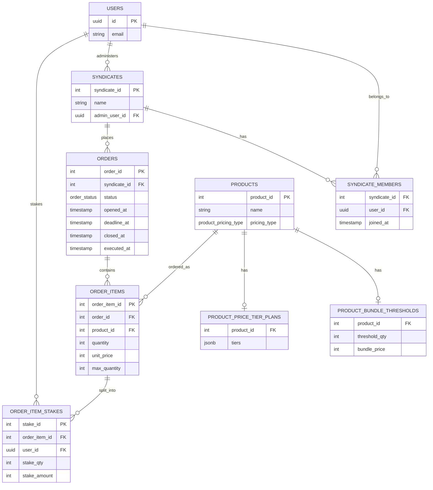

# Project context: syndicate purchase-coordination platform (PostgreSQL)

The ERD below is source of truth for table/column structure. `supabase/migrations/` is source of truth for exact SQL. The "Constraints, triggers & views" section only documents behavior the ERD can't express — don't let it drift into a second copy of column definitions. If an implementation decision depends on one of the open questions, flag it rather than guessing.

## Goal
Design a Supabase backend for a syndicate purchase-coordination platform — **not a retailer**. The platform lets syndicates (member groups) pool resources toward bulk purchases of external products, and tracks who owns what share of the total order. It does not sell, stock, ship, or fulfill anything itself, and it does not process payment — its job is coordinating who's committed to what and for how much, tracked as a ledger that members settle outside the app. Two pricing models exist: fixed-price bundles where users buy divisions of a bundled product offer ("6-pack wine case for $50"), and products priced by quantity tiers, where unit price reduces relative to total quantity ordered ("10 for $100, 20 for $175") with an optional supply ceiling.  

## Key decisions
- The platform is a coordination/ledger layer, not a retailer. `products` represents the external item being pooled for, not inventory the platform owns.
- Primary account entity is Supabase `auth.users` — wired directly, no local `public.users`/profiles shadow table. Every FK to a person (`admin_user_id`, `order_item_stakes.user_id`) is `UUID REFERENCES auth.users(id)`.  **WILL CHANGE: SEE ROADMAP**
- Orders belong to syndicates, never directly to individual users. A solo buyer is a syndicate of one (necessarily an admin).
- `products.pricing_type` discriminates `threshold_bundle` (fixed pack price, requires N distinct buyers where N = pack size) vs `tiered` (sliding per-unit price by cumulative quantity).
- Threshold config lives in a 1-to-0/1 table (`product_bundle_thresholds`). Tiered config lives in a 1-to-0/1 table with a JSONB plan (`product_price_tier_plans`).
- `order_item_stakes` splits one `order_items` row's quantity across syndicate members. `stake_amount` is a **pure ledger figure** — no payment processing in-app, members settle externally. Stored (not derived from `stake_qty × unit_price`) since cent-rounding on indivisible bundle splits can make it diverge.
- **All money columns are `INTEGER` cents in EURO, never `NUMERIC`/decimal** (`product_bundle_thresholds.bundle_price`, `product_price_tier_plans.tiers` JSONB values, `order_items.unit_price`, `order_item_stakes.stake_amount`) — eliminates floating point and keeps every price an exact whole-cent integer end to end.
- Rounding: work in integer cents, distribute leftover cents by **smallest-remainder-first apportionment**, applied the instant a `threshold_bundle` item's stakes fill `threshold_qty`: each stake's ideal share is `bundle_price / threshold_qty × stake_qty`, every stake gets `floor()` of that, and the leftover cents (always fewer than there are stakes) go one-per-stake to whichever stakes had the *smallest* fractional remainder — ties broken by ascending `stake_id`. This is the mirror of the Hamilton (largest-remainder) method: it deliberately routes the marginal cent to whoever's ideal share was already closest to the floor. Before that instant (and always, for `tiered` items), `stake_amount` is kept at the plain default `stake_qty × unit_price` — never left as whatever the caller supplied — so the column is authoritative from the first `INSERT`, not just from the resolution instant onward.
- Each syndicate has exactly one admin (`syndicates.admin_user_id`), who opens orders and sets `deadline_at`. Orders can only ever be opened, closed, or executed by that same admin.
- Currently, each syndicate member can belong to only one syndicate.  This may change in future.
- **`orders.status` has three states: `open` → `closed` → `executed`, strictly forward, no skipping.** An order closes either automatically (deadline job) or manually (admin action). An order is marked `executed` by the admin once payment has been made externally (`executed_at`) — this is a pure audit flag with no effect on item resolution logic beyond what `closed` already triggers.
- `order_items` has no stored `status`. Resolution is derived, and **resolves per item independent of the parent order's status**: a threshold item resolves as 'succeeded' the instant `quantity` hits `threshold_qty`; a tiered item with a `max_quantity` set resolves to 'maxed_out' the instant `quantity` hits it.  Otherwise, `order_items.status` is `open`.
- **Threshold items are hard-capped at exactly `threshold_qty`** — a stake that would push `quantity` past it is rejected outright (not clamped). No new column needed; enforced entirely by trigger, since the cap value lives on a different table (`product_bundle_thresholds`).
- **Tiered items may optionally carry a per-order-item supply cap** — `order_items.max_quantity` (nullable). `NULL` = uncapped, unchanged default behavior. Deliberately per-item only, no product-level default: admin sets it when creating the item, and can raise or lower it during the open window with a plain `UPDATE` (this also covers "the vendor's available supply just changed," no separate mechanism needed). A stake that would exceed it is **rejected outright**, same behavior as the threshold case, enforced by the same trigger function.
- Explicitly out of scope: cross-order inventory tracking. Caps are per order-item instance, not a running total across a product's history — that would reintroduce the inventory tracking this platform deliberately doesn't do.
- No FK in this schema declares `ON DELETE` behavior, which leaves every one of them at Postgres's default, `NO ACTION` (blocks the delete if referencing rows exist). For the ledger-critical chain — `order_items.order_id`, `order_items.product_id`, `order_item_stakes.order_item_id` — this is intentional, not an unconsidered default: deleting an `orders` or `order_items` row that still has children must fail outright, never cascade, since a coordination ledger's whole premise is that stake history is never silently destroyed as a side effect of deleting something else.
- Five rules require a trigger rather than a plain `FK`/`CHECK`, because Postgres `CHECK` constraints can't reference other tables and can't compare a row's old vs. new values:
  - `syndicates.admin_user_id` must be a `syndicate_members` row for that syndicate. *(trigger written, below — a deferred constraint trigger, since the membership row can't exist before the syndicate row does)*
  - `order_item_stakes.user_id` must be a `syndicate_members` row for the syndicate that owns the parent order. *(trigger written, below)*
  - Stake inserts/updates must not push `order_items.quantity` past its capacity ceiling (`threshold_qty` for bundles, `max_quantity` for tiered). *(trigger written, below)*
  - `orders.status` must only move forward (`open` → `closed` → `executed`), never skip or reverse. *(trigger written, below)*
  - `order_items.quantity` must stay in sync with `SUM(order_item_stakes.stake_qty)`. *(trigger written, below — `sync_order_item_quantity`, decided as trigger-maintained rather than computed-on-read)*

## Constraints, triggers & views (not representable in the ERD)
Table/column structure lives in the ERD below; exact SQL lives in `supabase/migrations/`. This section is a durable index of the behavior that lives in that SQL but that a mermaid ERD has no notation for — single/multi-column `CHECK`s, cross-table triggers, and derived views — so it survives even as migrations get added, edited, or squashed.

**Enum types**
| Type | Values | Used by |
|---|---|---|
| `product_pricing_type` | `threshold_bundle`, `tiered` | `products.pricing_type` |
| `order_status` | `open`, `closed`, `executed` | `orders.status` |
| `order_item_resolution_status` | `open`, `succeeded`, `maxed_out` | `order_item_resolution.resolution_status` (view output, cast via `::order_item_resolution_status`) |

These were plain `TEXT` + `CHECK (... IN (...))` originally; converted to native Postgres enums so `pnpm run db:generate-types` emits real TypeScript literal unions (e.g. `"open" | "closed" | "executed"`) instead of `string`. Comparisons/assignments against string literals (`'open'`, etc.) still work unchanged — Postgres implicitly casts an untyped string literal to the enum type on comparison or assignment.

**Triggers**
| Trigger | Table / timing | Enforces |
|---|---|---|
| `trg_check_admin_is_member` | `syndicates`, `AFTER INSERT OR UPDATE`, deferred to `COMMIT` | `admin_user_id` must be a `syndicate_members` row for that syndicate. Deferred (not plain `BEFORE`) because the membership row can't exist before the syndicate row does — lets a caller insert both in either order within one transaction. |
| `trg_order_status_transition` | `orders`, `BEFORE UPDATE OF status` | `status` only moves `open` → `closed` → `executed`, never skips or reverses. |
| `trg_check_stake_capacity` | `order_item_stakes`, `BEFORE INSERT OR UPDATE` | A stake can't push `order_items.quantity` past its ceiling — `threshold_qty` (via `product_bundle_thresholds`) for `threshold_bundle` products, `max_quantity` for `tiered` products. Overflow is **rejected outright, never clamped**. Locks the parent `order_items` row (`SELECT ... FOR UPDATE`) before reading the current sum, so two concurrent stakes on the same item can't both read a pre-insert sum and together overflow the ceiling (a write-skew race otherwise possible under MVCC/READ COMMITTED). |
| `trg_check_stake_user_is_member` | `order_item_stakes`, `BEFORE INSERT OR UPDATE` | `user_id` must be a `syndicate_members` row for the syndicate that owns the parent order (`order_item_stakes` → `order_items` → `orders` → `syndicate_id`). |
| `trg_sync_order_item_quantity` | `order_item_stakes`, `AFTER INSERT OR UPDATE OR DELETE` | Keeps `order_items.quantity` equal to `SUM(order_item_stakes.stake_qty)` for its `order_item_id`. Runs after the two `BEFORE` triggers above have already rejected any overflow, so this write-back can never violate `order_items`' own `quantity <= max_quantity` check. Also resyncs both old and new parent if a stake's `order_item_id` is reassigned on `UPDATE`. |
| `trg_sync_stake_amount_on_stake_qty` | `order_item_stakes`, `AFTER INSERT OR UPDATE OF stake_qty` | Keeps `stake_amount` authoritative on every `stake_qty` change, via two mutually exclusive paths. The instant a `threshold_bundle` item's stakes sum to `threshold_qty`, rewrites every constituent stake's `stake_amount` via smallest-remainder-first apportionment so they sum exactly to `bundle_price` — ties broken by ascending `stake_id`. Otherwise (`tiered` items, always; `threshold_bundle` items still below `threshold_qty`) writes the plain default `stake_qty × unit_price`, overwriting whatever the caller supplied. Scoped to `UPDATE OF stake_qty` (not a plain `UPDATE`) specifically so its own writes to `stake_amount` can't re-trigger itself. |

**Views**
| View | Derives |
|---|---|
| `order_item_resolution` | Per-`order_item_id` `resolution_status` (`open` / `succeeded` / `maxed_out`), not stored. A `threshold_bundle` item succeeds the instant `quantity >= threshold_qty`; a `tiered` item with `max_quantity` set resolves to `maxed_out` the instant `quantity` hits it — both independent of the parent order's status. Everything else — an unfilled `threshold_bundle`, or a `tiered` item with no `max_quantity` set or below it — stays `open`, regardless of `orders.status`. |

## ERD (mermaid, current state)

## Open questions
- [ ] **Can members edit or withdraw a stake while an order is open?** Sharper now than before: if a threshold or capped-tiered item has already resolved early (hit its ceiling), does a withdrawal reopen it back to `pending`, or should a resolved item lock out further edits entirely? Not decided.
- [x] ~~Deterministic rule for who absorbs leftover rounding cents~~ — decided: smallest-remainder-first, ties broken by ascending `stake_id`. See `trg_sync_stake_amount_on_stake_qty` above.
- [ ] `order_item_resolution` is a plain `VIEW` for now — confirm that's the right mechanism vs. a stored/materialized resolution if this needs to scale.
- [x] ~~No `ON DELETE` behavior specified on any FK~~ — decided for the ledger-critical chain: `NO ACTION` is intentional for `order_items.order_id`/`product_id` and `order_item_stakes.order_item_id`, see Key decisions above. The remaining FKs (`syndicates.admin_user_id`, `syndicate_members.syndicate_id`/`user_id`, `orders.syndicate_id`, `order_item_stakes.user_id`) are still just the unconsidered `NO ACTION` default — not revisited here, since they sit outside the stakes→items→orders chain this question was raised about.

