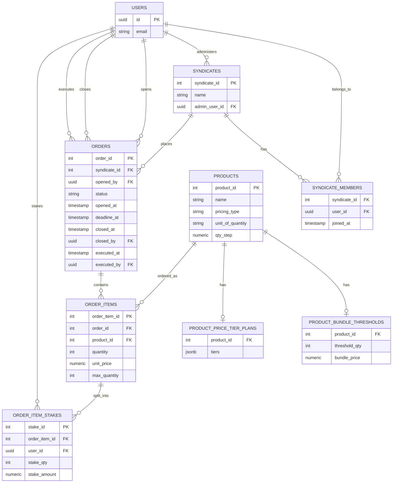

# Project context: syndicate purchase-coordination platform (PostgreSQL)

Use the schema below as source of truth. If an implementation decision depends on one of the open questions, flag it rather than guessing.

## Goal
Design a PostgreSQL schema for a syndicate purchase-coordination platform — **not a retailer**. The platform lets syndicates (member groups) pool stakes toward bulk purchases of external products. It does not sell, stock, ship, or fulfill anything itself, and it does not process payment — its job is coordinating who's committed to what and for how much, tracked as a ledger that members settle outside the app. Two pricing models exist: fixed-price bundles requiring a minimum number of distinct buyers, and per-unit tiered pricing with an optional supply ceiling.

## Key decisions
- The platform is a coordination/ledger layer, not a retailer. `products` represents the external item being pooled for, not inventory the platform owns.
- Primary account entity is Supabase `auth.users` — wired directly, no local `public.users`/profiles shadow table. Every FK to a person (`admin_user_id`, `opened_by`, `closed_by`, `executed_by`, `order_item_stakes.user_id`) is `UUID REFERENCES auth.users(id)`.
- Orders belong to syndicates, never directly to individual users. A solo buyer is a syndicate of one.
- `products.pricing_type` discriminates `threshold_bundle` (fixed pack price, requires N distinct buyers where N = pack size) vs `tiered` (sliding per-unit price by cumulative quantity).
- Threshold config lives in a 1-to-0/1 table (`product_bundle_thresholds`). Tiered config lives in a 1-to-0/1 table with a JSONB plan (`product_price_tier_plans`).
- `order_item_stakes` splits one `order_items` row's quantity across syndicate members. `stake_amount` is a **pure ledger figure** — no payment processing in-app, members settle externally. Stored (not derived from `stake_qty × unit_price`) since cent-rounding on indivisible bundle splits can make it diverge.
- Rounding: work in integer cents, `floor(total_cents / n)` per member, distribute leftover cents by a deterministic rule (rule TBD — see open questions). Never use floating point for money.
- Each syndicate has exactly one admin (`syndicates.admin_user_id`), who opens orders and sets `deadline_at`.
- **`orders.status` has three states: `open` → `closed` → `executed`, strictly forward, no skipping.** An order closes either automatically (deadline job) or manually (admin action, recorded via `closed_by`). An order is marked `executed` by an admin once payment has been made externally (`executed_by`/`executed_at`) — this is a pure audit flag with no effect on item resolution logic beyond what `closed` already triggers.
- `order_items` has no stored `status`. Resolution is derived, and **now resolves early, per item, independent of the parent order's status**: a threshold item resolves the instant `quantity` hits `threshold_qty`; a tiered item with a `max_quantity` set resolves the instant `quantity` hits it. Only items that haven't hit a cap wait for the order to close.
- **Threshold items are hard-capped at exactly `threshold_qty`** — a stake that would push `quantity` past it is rejected outright (not clamped). No new column needed; enforced entirely by trigger, since the cap value lives on a different table (`product_bundle_thresholds`).
- **Tiered items may optionally carry a per-order-item supply cap** — `order_items.max_quantity` (nullable). `NULL` = uncapped, unchanged default behavior. Deliberately per-item only, no product-level default: admin sets it when creating the item, and can raise or lower it during the open window with a plain `UPDATE` (this also covers "the vendor's available supply just changed," no separate mechanism needed). A stake that would exceed it is **rejected outright**, same behavior as the threshold case, enforced by the same trigger function.
- Explicitly out of scope: cross-order inventory tracking. Caps are per order-item instance, not a running total across a product's history — that would reintroduce the inventory tracking this platform deliberately doesn't do.
- Five rules require a trigger rather than a plain `FK`/`CHECK`, because Postgres `CHECK` constraints can't reference other tables and can't compare a row's old vs. new values:
  - `syndicates.admin_user_id` must be a `syndicate_members` row for that syndicate. *(trigger written, below — a deferred constraint trigger, since the membership row can't exist before the syndicate row does)*
  - `order_item_stakes.user_id` must be a `syndicate_members` row for the syndicate that owns the parent order. *(trigger written, below)*
  - Stake inserts/updates must not push `order_items.quantity` past its capacity ceiling (`threshold_qty` for bundles, `max_quantity` for tiered). *(trigger written, below)*
  - `orders.status` must only move forward (`open` → `closed` → `executed`), never skip or reverse. *(trigger written, below)*
  - `order_items.quantity` must stay in sync with `SUM(order_item_stakes.stake_qty)`. *(trigger written, below — `sync_order_item_quantity`, decided as trigger-maintained rather than computed-on-read)*

## Schema (agreed DDL)
```sql
-- Users & syndicates
-- No local users table -- wired directly to Supabase auth.users (id UUID PK).

CREATE TABLE syndicates (
    syndicate_id   SERIAL PRIMARY KEY,
    name           TEXT NOT NULL,
    admin_user_id  UUID NOT NULL REFERENCES auth.users(id)
    -- admin_user_id must also be a syndicate_members row for this syndicate -- see deferred trigger below
);

CREATE TABLE syndicate_members (
    syndicate_id  INTEGER NOT NULL REFERENCES syndicates(syndicate_id),
    user_id       UUID NOT NULL REFERENCES auth.users(id),
    joined_at     TIMESTAMPTZ NOT NULL DEFAULT now(),
    PRIMARY KEY (syndicate_id, user_id)
);

-- Products: external items being pooled for. This platform holds no inventory.
CREATE TABLE products (
    product_id    SERIAL PRIMARY KEY,
    name          TEXT NOT NULL,
    description   TEXT,
    pricing_type  TEXT NOT NULL CHECK (pricing_type IN ('threshold_bundle', 'tiered')),
    created_at    TIMESTAMPTZ DEFAULT now()
);

-- threshold_bundle products only
CREATE TABLE product_bundle_thresholds (
    product_id     INTEGER PRIMARY KEY REFERENCES products(product_id),
    threshold_qty  INTEGER NOT NULL CHECK (threshold_qty > 0),
    bundle_price   NUMERIC(10,2) NOT NULL
    -- per-unit price = bundle_price / threshold_qty
);

-- tiered products only
CREATE TABLE product_price_tier_plans (
    product_id  INTEGER PRIMARY KEY REFERENCES products(product_id),
    tiers       JSONB NOT NULL
    -- e.g. {"1": 24.99, "5": 21.50, "10": 18.00}
    -- keys = min cumulative qty (string), values = unit price at that qty and above
);

-- Orders: coordination records, not fulfillment records. Belong to syndicates.
CREATE TABLE orders (
    order_id      SERIAL PRIMARY KEY,
    syndicate_id  INTEGER NOT NULL REFERENCES syndicates(syndicate_id),
    opened_by     UUID NOT NULL REFERENCES auth.users(id),
    status        TEXT NOT NULL DEFAULT 'open' CHECK (status IN ('open', 'closed', 'executed')),
    opened_at     TIMESTAMPTZ NOT NULL DEFAULT now(),
    deadline_at   TIMESTAMPTZ NOT NULL,
    closed_at     TIMESTAMPTZ,
    closed_by     UUID REFERENCES auth.users(id),   -- NULL if closed automatically at deadline
    executed_at   TIMESTAMPTZ,
    executed_by   UUID REFERENCES auth.users(id),
    CHECK (deadline_at > opened_at),
    CHECK (executed_at IS NULL OR closed_at IS NULL OR executed_at >= closed_at)
);

CREATE TABLE order_items (
    order_item_id SERIAL PRIMARY KEY,
    order_id      INTEGER NOT NULL REFERENCES orders(order_id),
    product_id    INTEGER NOT NULL REFERENCES products(product_id),
    quantity      INTEGER NOT NULL DEFAULT 0,
    unit_price    NUMERIC(10,2) NOT NULL,
    max_quantity  INTEGER CHECK (max_quantity IS NULL OR max_quantity > 0),
    -- tiered items only; NULL = uncapped. Threshold items are capped via threshold_qty instead.
    CHECK (quantity >= 0),
    CHECK (max_quantity IS NULL OR quantity <= max_quantity)
    -- quantity is trigger-maintained from order_item_stakes -- see sync_order_item_quantity below
    -- unit_price: fixed at creation for threshold_bundle; live for tiered
);

-- Stakes: who owes what for an order item (ledger only -- no payment processing)
CREATE TABLE order_item_stakes (
    stake_id       SERIAL PRIMARY KEY,
    order_item_id  INTEGER NOT NULL REFERENCES order_items(order_item_id),
    user_id        UUID NOT NULL REFERENCES auth.users(id),
    stake_qty      INTEGER NOT NULL CHECK (stake_qty > 0),
    stake_amount   NUMERIC(10,2) NOT NULL
    -- stake_amount is a ledger figure only -- no payment processing in-app
    -- user_id must be a syndicate_members row for the order's syndicate -- see trigger below
);

-- Trigger: syndicate admin must be a member of their own syndicate.
-- A plain BEFORE INSERT trigger can't work here: syndicate_members.syndicate_id
-- has an FK to syndicates, so no membership row can exist until the syndicate
-- row itself exists. Deferred to COMMIT so callers can insert the syndicate
-- row and its matching syndicate_members row in either order within one
-- transaction; the check only runs once both are in place.
CREATE OR REPLACE FUNCTION check_admin_is_member() RETURNS TRIGGER AS $$
BEGIN
  IF NOT EXISTS (
    SELECT 1 FROM syndicate_members
    WHERE syndicate_id = NEW.syndicate_id
      AND user_id = NEW.admin_user_id
  ) THEN
    RAISE EXCEPTION 'admin_user_id must be a member of the syndicate';
  END IF;
  RETURN NEW;
END;
$$ LANGUAGE plpgsql;

-- FOR EACH ROW still fires once per affected row, same as any row trigger;
-- DEFERRABLE INITIALLY DEFERRED only delays *when* each firing runs (to COMMIT
-- instead of immediately), not which rows it covers.
CREATE CONSTRAINT TRIGGER trg_check_admin_is_member
AFTER INSERT OR UPDATE ON syndicates
DEFERRABLE INITIALLY DEFERRED
FOR EACH ROW EXECUTE FUNCTION check_admin_is_member();

-- Trigger: orders.status can only move forward (open -> closed -> executed)
CREATE OR REPLACE FUNCTION check_order_status_transition() RETURNS TRIGGER AS $$
BEGIN
  IF OLD.status = 'open' AND NEW.status NOT IN ('open', 'closed') THEN
    RAISE EXCEPTION 'orders can only move from open to closed';
  ELSIF OLD.status = 'closed' AND NEW.status NOT IN ('closed', 'executed') THEN
    RAISE EXCEPTION 'orders can only move from closed to executed';
  ELSIF OLD.status = 'executed' AND NEW.status != 'executed' THEN
    RAISE EXCEPTION 'executed orders cannot change status';
  END IF;
  RETURN NEW;
END;
$$ LANGUAGE plpgsql;

CREATE TRIGGER trg_order_status_transition
BEFORE UPDATE OF status ON orders
FOR EACH ROW EXECUTE FUNCTION check_order_status_transition();

-- Trigger: stakes cannot push an order item past its capacity ceiling
-- (threshold_qty for threshold_bundle products, max_quantity for tiered products)
-- Overflow is rejected outright, never clamped.
CREATE OR REPLACE FUNCTION check_stake_capacity() RETURNS TRIGGER AS $$
DECLARE
  v_pricing_type TEXT;
  v_threshold    INTEGER;
  v_max_qty      INTEGER;
  v_current_qty  INTEGER;
BEGIN
  SELECT p.pricing_type, pbt.threshold_qty, oi.max_quantity
    INTO v_pricing_type, v_threshold, v_max_qty
  FROM order_items oi
  JOIN products p ON p.product_id = oi.product_id
  LEFT JOIN product_bundle_thresholds pbt ON pbt.product_id = p.product_id
  WHERE oi.order_item_id = NEW.order_item_id;

  SELECT COALESCE(SUM(stake_qty), 0) INTO v_current_qty
  FROM order_item_stakes
  WHERE order_item_id = NEW.order_item_id
    AND stake_id != COALESCE(NEW.stake_id, -1);  -- exclude self on UPDATE

  IF v_pricing_type = 'threshold_bundle' AND v_current_qty + NEW.stake_qty > v_threshold THEN
    RAISE EXCEPTION 'stake would exceed bundle threshold of % (already at %)', v_threshold, v_current_qty;
  END IF;

  IF v_pricing_type = 'tiered' AND v_max_qty IS NOT NULL AND v_current_qty + NEW.stake_qty > v_max_qty THEN
    RAISE EXCEPTION 'stake would exceed available quantity of % (already at %)', v_max_qty, v_current_qty;
  END IF;

  RETURN NEW;
END;
$$ LANGUAGE plpgsql;

CREATE TRIGGER trg_check_stake_capacity
BEFORE INSERT OR UPDATE ON order_item_stakes
FOR EACH ROW EXECUTE FUNCTION check_stake_capacity();

-- Trigger: a staker must be a member of the syndicate that owns the parent order
-- (order_item_stakes.user_id -> order_items -> orders -> syndicate_id)
CREATE OR REPLACE FUNCTION check_stake_user_is_member() RETURNS TRIGGER AS $$
DECLARE
  v_syndicate_id INTEGER;
BEGIN
  SELECT o.syndicate_id INTO v_syndicate_id
  FROM order_items oi
  JOIN orders o ON o.order_id = oi.order_id
  WHERE oi.order_item_id = NEW.order_item_id;

  IF NOT EXISTS (
    SELECT 1 FROM syndicate_members
    WHERE syndicate_id = v_syndicate_id
      AND user_id = NEW.user_id
  ) THEN
    RAISE EXCEPTION 'user_id must be a member of the syndicate that owns this order';
  END IF;

  RETURN NEW;
END;
$$ LANGUAGE plpgsql;

CREATE TRIGGER trg_check_stake_user_is_member
BEFORE INSERT OR UPDATE ON order_item_stakes
FOR EACH ROW EXECUTE FUNCTION check_stake_user_is_member();

-- Trigger: keep order_items.quantity in sync with SUM(order_item_stakes.stake_qty).
-- Runs AFTER the two BEFORE triggers above have already rejected any overflow,
-- so this write-back can never violate order_items' own quantity <= max_quantity
-- CHECK. Handles DELETE (no NEW row) and the unlikely case of a stake being
-- reassigned to a different order_item_id on UPDATE (resyncs both parents).
CREATE OR REPLACE FUNCTION sync_order_item_quantity() RETURNS TRIGGER AS $$
DECLARE
  v_order_item_id INTEGER;
BEGIN
  IF TG_OP = 'DELETE' THEN
    v_order_item_id := OLD.order_item_id;
  ELSE
    v_order_item_id := NEW.order_item_id;
  END IF;

  UPDATE order_items
  SET quantity = COALESCE(
    (SELECT SUM(stake_qty) FROM order_item_stakes WHERE order_item_id = v_order_item_id), 0
  )
  WHERE order_item_id = v_order_item_id;

  IF TG_OP = 'UPDATE' AND OLD.order_item_id IS DISTINCT FROM NEW.order_item_id THEN
    UPDATE order_items
    SET quantity = COALESCE(
      (SELECT SUM(stake_qty) FROM order_item_stakes WHERE order_item_id = OLD.order_item_id), 0
    )
    WHERE order_item_id = OLD.order_item_id;
  END IF;

  RETURN NULL;
END;
$$ LANGUAGE plpgsql;

CREATE TRIGGER trg_sync_order_item_quantity
AFTER INSERT OR UPDATE OR DELETE ON order_item_stakes
FOR EACH ROW EXECUTE FUNCTION sync_order_item_quantity();

-- Derived resolution (not stored). Items resolve early on hitting their own
-- capacity ceiling, independent of the parent order's status; everything else
-- waits for the order to close.
CREATE OR REPLACE VIEW order_item_resolution AS
SELECT
  oi.order_item_id,
  CASE
    WHEN p.pricing_type = 'threshold_bundle' AND oi.quantity >= pbt.threshold_qty THEN 'succeeded'
    WHEN p.pricing_type = 'tiered' AND oi.max_quantity IS NOT NULL AND oi.quantity >= oi.max_quantity THEN 'succeeded'
    WHEN o.status = 'open' THEN 'pending'
    WHEN p.pricing_type = 'threshold_bundle' THEN 'failed'
    WHEN p.pricing_type = 'tiered' AND oi.quantity > 0 THEN 'succeeded'
    ELSE 'failed'
  END AS resolution_status
FROM order_items oi
JOIN orders o ON o.order_id = oi.order_id
JOIN products p ON p.product_id = oi.product_id
LEFT JOIN product_bundle_thresholds pbt ON pbt.product_id = p.product_id;
```

## ERD (mermaid, current state)

Note: `closed_by` and `executed_by` are nullable FKs (mermaid draws them the same as the mandatory `opened_by` — it can't express optionality on its own).

## Open questions
- [ ] **Can members edit or withdraw a stake while an order is open?** Sharper now than before: if a threshold or capped-tiered item has already resolved early (hit its ceiling), does a withdrawal reopen it back to `pending`, or should a resolved item lock out further edits entirely? Not decided.
- [ ] Deterministic rule for who absorbs leftover rounding cents — options raised: first N stakers by `stake_id`, rotate across orders, or largest-remainder-first.
- [ ] Does the schema need a hook for where/how the actual external purchase happens once an item succeeds, or is that entirely manual/off-platform?
- [ ] `order_item_resolution` is a plain `VIEW` for now — confirm that's the right mechanism vs. a stored/materialized resolution if this needs to scale.
- [ ] Wiring FKs straight to `auth.users(id)` means the `authenticated`/`anon` roles have no `SELECT` on `auth.users` by default (Supabase locks that schema down) — any read path that needs to show a member's name/email (syndicate rosters, staker lists) will need a `public` view/function exposing just the safe columns, or a denormalized column, rather than joining `auth.users` directly from client-facing queries. Not designed yet.

