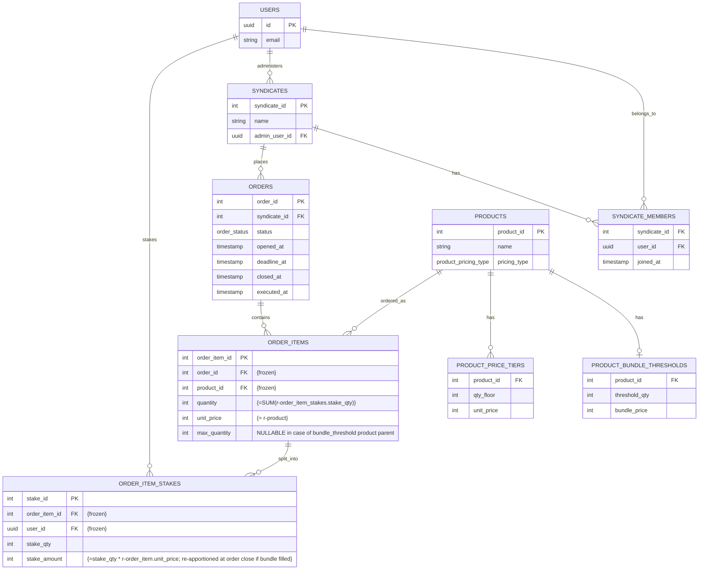

# Project context: syndicate purchase-coordination platform (PostgreSQL)

The ERD below is source of truth for table/column structure. `supabase/migrations/` is source of truth for exact SQL. The "Constraints, triggers & views" section only documents behavior the ERD can't express — don't let it drift into a second copy of column definitions. If an implementation decision depends on one of the open questions, flag it rather than guessing.

## Goal

Design a Supabase backend for a syndicate purchase-coordination platform — **not a retailer**. The platform lets syndicates (member groups) pool resources toward bulk purchases of external products, and tracks who owns what share of the total order. It does not sell, stock, ship, or fulfill anything itself, and it does not process payment — its job is coordinating who's committed to what and for how much, tracked as a ledger that members settle outside the app. Two pricing models exist: fixed-price bundles where users buy divisions of a bundled product offer ("6-pack wine case for $50"), and products priced by quantity tiers, where unit price reduces relative to total quantity ordered ("10 for $100, 20 for $175") with an optional supply ceiling.

## Key decisions

- The platform is a coordination/ledger layer, not a retailer. `products` represents the external item being pooled for, not inventory the platform owns.
- Primary account entity is Supabase `auth.users` — wired directly, no local `public.users`/profiles shadow table. Every FK to a person (`admin_user_id`, `order_item_stakes.user_id`) is `UUID REFERENCES auth.users(id)`. **WILL CHANGE: SEE ROADMAP**
- Orders belong to syndicates, never directly to individual users. A solo buyer is a syndicate of one (necessarily an admin).
- `products.pricing_type` discriminates `threshold_bundle` (fixed pack price, requires N distinct buyers where N = pack size) vs `tiered` (sliding per-unit price by cumulative quantity).
- Threshold config lives in a 1-to-0/1 table (`product_bundle_thresholds`). Tiered config lives in a 1-to-many table, one row per price break (`product_price_tiers`) — a JSONB plan was tried first but dropped: querying/validating individual tiers (sorting by quantity, rejecting duplicate breakpoints) is what a relational table is for, and doing it through `plpgsql` JSONB parsing in a trigger was needlessly awkward.
- `order_item_stakes` splits one `order_items` row's quantity across syndicate members. `stake_amount` is a **pure ledger figure** — no payment processing in-app, members settle externally. Stored (not derived from `stake_qty × unit_price`) since cent-rounding on indivisible bundle splits can make it diverge. **Provisional while the parent order is `open`, authoritative from `closed` onward** — a filled bundle's stakes sum to slightly less than `bundle_price` until close (see Rounding), so anything needing a filled bundle's true total before then reads `bundle_price`, not `SUM(stake_amount)`.
- **All money columns are `INTEGER` cents in EURO, never `NUMERIC`/decimal** (`product_bundle_thresholds.bundle_price`, `product_price_tiers.unit_price`, `order_items.unit_price`, `order_item_stakes.stake_amount`) — eliminates floating point and keeps every price an exact whole-cent integer end to end.
- Rounding: work in integer cents, distribute leftover cents by **smallest-remainder-first apportionment**, applied once, when the parent order moves `open` → `closed`, to every `threshold_bundle` item that is filled at that moment: each stake's ideal share is `bundle_price / threshold_qty × stake_qty`, every stake gets `floor()` of that, and the leftover cents (always fewer than there are stakes) go one-per-stake to whichever stakes had the _smallest_ fractional remainder — ties broken by ascending `stake_id`. This is the mirror of the Hamilton (largest-remainder) method: it deliberately routes the marginal cent to whoever's ideal share was already closest to the floor. At every other moment — the whole open window, and always for `tiered` items — `stake_amount` is the plain `stake_qty × unit_price`, never whatever the caller supplied.

  **Apportioning at close rather than the instant an item fills is deliberate.** Filling is not a terminal state: a bundle can fill and then un-fill while the order is open (a member withdraws, or reduces `stake_qty`). Apportionment is inherently cross-row — one stake's leftover cent depends on every sibling's remainder — so doing it eagerly means every stake write on a filled item must re-derive all its siblings, and an earlier revision that did this on the way *in* but not on the way *out* left withdrawn-from packs carrying remainder cents they were no longer entitled to. Deferring to close removes the cross-row rule from the per-write path entirely: during the open window the formula is per-row and idempotent, so `DELETE` needs no `stake_amount` handling at all. Close is also the right moment in domain terms — the admin needs final per-member figures *before* paying the vendor externally, which is what `executed` records.
- Each syndicate has exactly one admin (`syndicates.admin_user_id`), who opens orders and sets `deadline_at`. Orders can only ever be opened, closed, or executed by that same admin.
- Currently, each syndicate member can belong to only one syndicate. This may change in future.
- **`orders.status` has three states: `open` → `closed` → `executed`, strictly forward, no skipping.** An order closes either automatically (deadline job) or manually (admin action). An order is marked `executed` by the admin once payment has been made externally (`executed_at`) — this is a pure audit flag with no effect on item resolution logic beyond what `closed` already triggers.
- `order_items` has no stored `status`. Resolution is derived, and **resolves per item independent of the parent order's status**: a threshold item resolves as 'succeeded' the instant `quantity` hits `threshold_qty`; a tiered item with a `max_quantity` set resolves to 'maxed_out' the instant `quantity` hits it. Otherwise, `order_items.status` is `open`.
- **Threshold items are hard-capped at exactly `threshold_qty`** — a stake that would push `quantity` past it is rejected outright (not clamped). No new column needed; enforced entirely by trigger, since the cap value lives on a different table (`product_bundle_thresholds`).
- **Tiered items may optionally carry a per-order-item supply cap** — `order_items.max_quantity` (nullable). `NULL` = uncapped, unchanged default behavior. Deliberately per-item only, no product-level default: admin sets it when creating the item, and can raise or lower it during the open window with a plain `UPDATE` (this also covers "the vendor's available supply just changed," no separate mechanism needed). A stake that would exceed it is **rejected outright**, same behavior as the threshold case, enforced by the same trigger function.
- **Tiered products have no minimum order quantity, and every tier ladder starts at `qty_floor = 0`.** This is a working assumption, not a modelled feature: a tiered product is assumed to be orderable at any quantity from zero upward, with the `qty_floor = 0` row supplying the baseline price. The invariant is load-bearing — `sync_tiered_unit_price` rejects any quantity with no covering tier, so a ladder starting above `0` would make an empty item (and therefore full stake withdrawal) unrepresentable. Nothing in the schema enforces that a `qty_floor = 0` row exists; `CHECK (qty_floor >= 0)` merely permits it, and the omission only surfaces as a runtime exception at the moment an item's quantity can't be priced. **Not modelled: a vendor minimum ("50 units or no deal").** That is a different concept from a price break — a floor below which the item fails to resolve rather than one that changes its price — and would need its own column plus a new `order_item_resolution` state, not another `product_price_tiers` row. Deferred — not modelled in this PoC (see `SPEC.md`'s PoC scope boundaries).
- **A stake's `order_item_id` is immutable** — a stake is never reassigned to a different order item. Moving a member's commitment between items means withdrawing and re-staking, so the ledger records both events rather than silently rewriting one. Decided, not yet enforced: the mechanism (RLS policy vs. `BEFORE UPDATE` trigger) is deferred to issue #3. Code that existed only to keep `order_items.quantity` correct across a reassignment has been removed, so until #3 lands a reassignment leaves both parents' `quantity` stale. This is the `{frozen}` annotation in the ERD below.
- **Stakes are writable only while the parent order is `open`.** Any `INSERT`/`UPDATE`/`DELETE` on `order_item_stakes` is rejected once the order is `closed` or `executed`, except a `DELETE` performed as `service_role` (used by admin/test cleanup — never by client-facing writes, which never hold the service-role key). This is what makes close-time apportionment final — a later stake write would leave every sibling's apportioned share stale, which is the same defect apportioning at close was adopted to remove. The guard locks the `orders` row (`FOR SHARE`) rather than reading its status plain, so the open→closed boundary is serialized against in-flight stake writes; an unlocked read leaves a window in which an item fills after apportionment has already passed it over.
- Explicitly out of scope: cross-order inventory tracking. Caps are per order-item instance, not a running total across a product's history — that would reintroduce the inventory tracking this platform deliberately doesn't do.
- No FK in this schema declares `ON DELETE` behavior, which leaves every one of them at Postgres's default, `NO ACTION` (blocks the delete if referencing rows exist). For the ledger-critical chain — `order_items.order_id`, `order_items.product_id`, `order_item_stakes.order_item_id` — this is intentional, not an unconsidered default: deleting an `orders` or `order_items` row that still has children must fail outright, never cascade, since a coordination ledger's whole premise is that stake history is never silently destroyed as a side effect of deleting something else.
- Nine rules require a trigger rather than a plain `FK`/`CHECK`/`DEFAULT`/generated column, because Postgres `CHECK` constraints can't reference other tables and can't compare a row's old vs. new values, a column `DEFAULT` can't see other columns of the row being inserted, and a `GENERATED ... STORED` column's expression must be immutable and same-row only:
  - `syndicates.admin_user_id` must be a `syndicate_members` row for that syndicate. _(**not currently enforced** — no trigger or RLS policy exists yet; a syndicate can be created with an admin who isn't a member. Deliberate, temporary gap — see Open questions.)_
  - `order_item_stakes.user_id` must be a `syndicate_members` row for the syndicate that owns the parent order. _(**not currently enforced** — same gap as above; a stake can be written for a `user_id` who isn't a member of the syndicate that owns the order. See Open questions.)_
  - Stake inserts/updates must not push `order_items.quantity` past its capacity ceiling (`threshold_qty` for bundles, `max_quantity` for tiered). _(trigger written, below)_
  - `orders.status` must only move forward (`open` → `closed` → `executed`), never skip or reverse. _(trigger written, below)_
  - Stakes must be rejected outright once the parent order leaves `open`. _(trigger written, below — `check_stake_order_is_open`)_
  - A filled `threshold_bundle` item's stakes must be restated to sum to exactly `bundle_price` when its order closes. _(trigger written, below — `apportion_on_close` → `apportion_bundle_stakes`)_
  - `order_item_stakes.order_item_id` must be immutable. _(**not** implemented — decided above, deferred to issue #3)_
  - `order_items.quantity` must stay in sync with `SUM(order_item_stakes.stake_qty)`. _(trigger written, below — `sync_order_item_quantity`, decided as trigger-maintained rather than computed-on-read)_
  - `order_items.unit_price` must be derived at creation from the product's pricing config rather than trusted from the caller — the `qty_floor = 0` tier for `tiered`, `bundle_price / threshold_qty` for `threshold_bundle`. _(trigger written, below — `init_order_item_unit_price`; a `DEFAULT` can't reference `NEW.product_id` and a generated column can't query another table, so a `BEFORE INSERT` trigger is the only mechanism that fits)_
  - `order_items.unit_price` must track the covering `product_price_tiers` row live, for `tiered` items, as `quantity` crosses tier boundaries — and every existing stake's `stake_amount` on that item must be retroactively recomputed against the new price, since pricing is "all-units" (the new price applies to the item's whole quantity, not just the marginal units). A quantity with no covering tier (including `quantity = 0` on a product with no `qty_floor = 0` baseline row) has the write that caused it rejected outright. _(trigger written, below — `sync_tiered_unit_price` + `sync_stake_amounts_on_unit_price`)_

## Constraints, triggers & views (not representable in the ERD)

Table/column structure lives in the ERD below; exact SQL lives in `supabase/migrations/`. This section is a durable index of the behavior that lives in that SQL but that a mermaid ERD has no notation for — single/multi-column `CHECK`s, cross-table triggers, and derived views — so it survives even as migrations get added, edited, or squashed.

**Enum types**
| Type | Values | Used by |
|---|---|---|
| `product_pricing_type` | `threshold_bundle`, `tiered` | `products.pricing_type` |
| `order_status` | `open`, `closed`, `executed` | `orders.status` |
| `order_item_resolution_status` | `open`, `succeeded`, `maxed_out` | `order_item_resolution.resolution_status` (view output, cast via `::order_item_resolution_status`) |

These were plain `TEXT` + `CHECK (... IN (...))` originally; converted to native Postgres enums so `pnpm run db:generate-types` emits real TypeScript literal unions (e.g. `"open" | "closed" | "executed"`) instead of `string`. Comparisons/assignments against string literals (`'open'`, etc.) still work unchanged — Postgres implicitly casts an untyped string literal to the enum type on comparison or assignment.

**Triggers**
| Trigger | Table / timing | Enforces |
|---|---|---|
| `trg_order_status_transition` | `orders`, `BEFORE UPDATE OF status` | `status` only moves `open` → `closed` → `executed`, never skips or reverses. |
| `trg_init_order_item_unit_price` | `order_items`, `BEFORE INSERT` | Derives `unit_price` at creation from the product's pricing config, overwriting anything the caller supplied (the column carries `DEFAULT 0` so callers can omit it). `tiered` → the `qty_floor = 0` baseline tier, the same value `trg_sync_tiered_unit_price` derives at `quantity = 0`, so creation and maintenance agree by construction. `threshold_bundle` → `bundle_price / threshold_qty`, integer division and so deliberately lossy (a per-unit approximation; apportionment restates stakes to sum to exactly `bundle_price` when the order closes). Missing pricing config raises. `BEFORE` rather than `AFTER` so it assigns `NEW.unit_price` in place — no `UPDATE`, so unlike the `order_items` triggers below it starts no cascade and cannot recurse. |
| `trg_check_stake_capacity` | `order_item_stakes`, `BEFORE INSERT OR UPDATE` | A stake can't push `order_items.quantity` past its ceiling — `threshold_qty` (via `product_bundle_thresholds`) for `threshold_bundle` products, `max_quantity` for `tiered` products. Overflow is **rejected outright, never clamped**. Locks the parent `order_items` row (`SELECT ... FOR UPDATE`) before reading the current sum, so two concurrent stakes on the same item can't both read a pre-insert sum and together overflow the ceiling (a write-skew race otherwise possible under MVCC/READ COMMITTED). Excludes the caller's own prior stake from that sum by `user_id` rather than `stake_id`, so a plain `UPDATE OF stake_qty` on an existing stake is checked against just everyone else's committed quantity. |
| `trg_check_stake_order_is_open` | `order_item_stakes`, `BEFORE INSERT OR UPDATE OF stake_qty, user_id, order_item_id OR DELETE` | Rejects any stake write once the parent order has left `open` (`order_item_stakes` → `order_items` → `orders`), except a `DELETE` executed as `service_role`, which is always allowed (admin/test cleanup only — clients never hold this role). This is what makes `trg_apportion_on_close` final. The `OF` list deliberately omits `stake_amount`: `apportion_bundle_stakes` writes that column *after* the order is already `closed` and would otherwise trip this guard — so a direct `stake_amount` write still slips through post-close, which is the hole the `stake_amount` policy `TODO` covers. Takes `FOR SHARE` on the `orders` row rather than reading it plain: under `READ COMMITTED` an uncommitted close is invisible, so without the lock an item could fill *after* `apportion_bundle_stakes` had already skipped it as unfilled — and since `orders.status` only moves forward, nothing would ever settle it. `SHARE` rather than `UPDATE` so concurrent stakes on one order still don't serialize against each other. Branches on `TG_OP` to read `OLD` on `DELETE`, where `NEW` is unassigned. |
| `trg_sync_order_item_quantity` | `order_item_stakes`, `AFTER INSERT OR UPDATE OF stake_qty OR DELETE` | Keeps `order_items.quantity` equal to `SUM(order_item_stakes.stake_qty)` for its `order_item_id`. Runs after the `BEFORE` triggers above have already rejected any overflow, so this write-back can never violate `order_items`' own `quantity <= max_quantity` check. `stake_qty` is the only column that can invalidate the sum, since `order_item_id` is immutable (decided; enforcement deferred to issue #3). Scoping to that one column also stops `trg_sync_stake_amounts_on_unit_price`'s bulk `stake_amount` rewrite from re-entering it once per repriced row. |
| `trg_sync_stake_amount_on_stake_qty` | `order_item_stakes`, `BEFORE INSERT OR UPDATE OF stake_qty` | Derives `stake_amount` as `stake_qty × the item's current unit_price`, overwriting anything the caller supplied (the column carries `DEFAULT 0` so callers can omit it). One row, no cross-row dependency — bundle remainder cents are settled separately by `trg_apportion_on_close`, so a bundle that fills and then un-fills during the open window can never strand them. `BEFORE` rather than `AFTER` so it assigns `NEW.stake_amount` in place: no self-`UPDATE`, so it cannot recurse, and it does not depend on firing after `trg_sync_order_item_quantity`. A `tiered` insert that crosses a tier boundary reads the pre-crossing `unit_price` here and is corrected moments later by `trg_sync_stake_amounts_on_unit_price`'s bulk rewrite. |
| `trg_sync_tiered_unit_price` | `order_items`, `AFTER UPDATE OF quantity` | For `tiered` items, looks up the `product_price_tiers` row with the highest `qty_floor <= quantity` and writes it to `unit_price` if it differs. Hangs off `order_items.quantity` (not `order_item_stakes` directly) so it uniformly covers every path that can move quantity — stake INSERT, UPDATE, and DELETE — since all three funnel through `trg_sync_order_item_quantity`'s `UPDATE order_items SET quantity = ...`. If no tier covers the new quantity (including `quantity = 0` on a product with no `qty_floor = 0` row), the write is **rejected outright** via exception, same as `trg_check_stake_capacity`'s overflow rejection. |
| `trg_sync_stake_amounts_on_unit_price` | `order_items`, `AFTER UPDATE OF unit_price` | Fired by `trg_sync_tiered_unit_price` whenever a tiered item's `unit_price` actually changes. Bulk-rewrites every stake on that item to `stake_qty × new unit_price`, so the ledger always reflects current tier pricing rather than the price at each stake's own creation time. Guarded to `tiered` items only, so it can never touch `threshold_bundle` apportionment. |
| `trg_apportion_on_close` | `orders`, `AFTER UPDATE OF status` | On `open` → `closed` only, calls `apportion_bundle_stakes(order_id)`: for every `threshold_bundle` item on that order whose `quantity` has reached `threshold_qty`, rewrites each stake to `floor(bundle_price × stake_qty / threshold_qty)` and hands the leftover cents one apiece to the **smallest** fractional remainders, ties by ascending `stake_id`, so the item's stakes sum to exactly `bundle_price`. Unfilled items are skipped — nothing resolved, nothing to settle. Guarded to that one transition so the later `closed` → `executed` move cannot re-run it. Defined in the stakes migration, not the orders one, because the function it calls reads `order_item_stakes`. |

**Views**
| View | Derives |
|---|---|
| `order_item_resolution` | Per-`order_item_id` `resolution_status` (`open` / `succeeded` / `maxed_out`), not stored. A `threshold_bundle` item succeeds the instant `quantity >= threshold_qty`; a `tiered` item with `max_quantity` set resolves to `maxed_out` the instant `quantity` hits it — both independent of the parent order's status. Everything else — an unfilled `threshold_bundle`, or a `tiered` item with no `max_quantity` set or below it — stays `open`, regardless of `orders.status`. |

## ERD (mermaid, current state)

## Open questions

- **Syndicate-membership checks are not currently enforced at the DB layer.** Neither `syndicates.admin_user_id` nor `order_item_stakes.user_id` is checked against `syndicate_members` — both were dropped from this rollout (previous triggers `check_admin_is_member`, `check_stake_user_is_member`) rather than fixed in place, since RLS hasn't landed yet and this schema-only pass wasn't the place to get that mechanism right. Until a trigger or RLS policy is added back, any `auth.users` UUID can be written to either column regardless of membership. Not yet tracked in an issue.

### Key for ERD
- columns marked with {frozen} are readonly invariants which cannot change after row creation.
  - all PKs are inherently {frozen} in this way
- columns marked with {=\<some logic\>} are derived invariants.  these values always reflect some computation sourced other other values, typically through server side logic with high level permissions.  End users should have no ability to write these.
  - within these \<some logic\> comments, the prefix "r-" indicates "related" as a shorthand for a WHERE clause acting on FK relation.  so `order_items.quantity "{=SUM(r-order_item_stakes.stake_qty)}" means "the sum of stake_qty values on order_item_stakes rows RELATED TO THIS order_item" (WHERE order_item_stakes.order_item_id = order_items.order_item_id)

