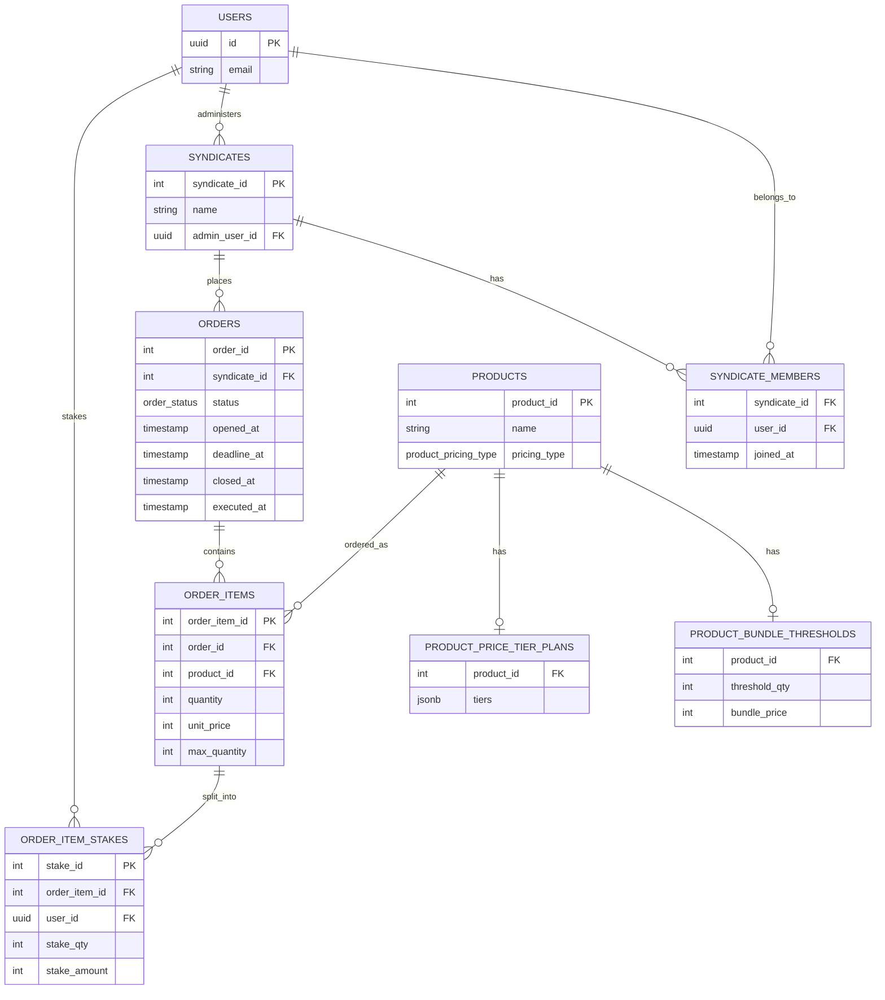

# AnteCat

## Get started

<!-- 1. Install dependencies

   ```bash
   pnpm install
   ```

2. Start the app

   ```bash
   pnpm start
   ```

In the output, you'll find options to open the app in a

- [development build](https://docs.expo.dev/develop/development-builds/introduction/)
- [Android emulator](https://docs.expo.dev/workflow/android-studio-emulator/)
- [iOS simulator](https://docs.expo.dev/workflow/ios-simulator/)
- [Expo Go](https://expo.dev/go), a limited sandbox for trying out app development with Expo

You can start developing by editing the files inside the **src/app** directory. This project uses [file-based routing](https://docs.expo.dev/router/introduction). -->

 ## Scripts

Package manager is pnpm (`packageManager` pinned in package.json — don't use npm/yarn).

- `pnpm start` — start the Metro dev server (Expo Go / dev client)
- `pnpm ios` / `pnpm android` / `pnpm web` — start and open on a specific platform
- `pnpm lint` — runs `expo lint` (ESLint, flat config via `eslint-config-expo/flat`)
- `pnpm reset-project` — moves `src/` and `scripts/` to `example/` (or deletes them) and creates a blank `src/app/` with `index.tsx`/`_layout.tsx`; run only when explicitly asked to strip the template
- `pnpm test` — run the Vitest suite once (`vitest run`)
- `pnpm test:watch` — run Vitest in watch mode

Integration tests (`tests/`) hit a local Supabase instance directly — run `supabase start` first, and fill in `.env.test.local` (see `.env.example`) with the local API URL/anon key from `supabase status`. Tests are type-checked separately from the app via `tsconfig.test.json` (Node-scoped, not the Expo/RN-scoped root `tsconfig.json`) — see `pnpm exec tsc -p tsconfig.test.json --noEmit`.

## Architecture

### Backend

**Triggers**
| Trigger | Table / timing | Enforces |
|---|---|---|
| `trg_check_admin_is_member` | `syndicates`, `AFTER INSERT OR UPDATE`, deferred to `COMMIT` | `admin_user_id` must be a `syndicate_members` row for that syndicate. Deferred (not plain `BEFORE`) because the membership row can't exist before the syndicate row does — lets a caller insert both in either order within one transaction. |
| `trg_order_status_transition` | `orders`, `BEFORE UPDATE OF status` | `status` only moves `open` → `closed` → `executed`, never skips or reverses. |
| `trg_check_stake_capacity` | `order_item_stakes`, `BEFORE INSERT OR UPDATE` | A stake can't push `order_items.quantity` past its ceiling — `threshold_qty` (via `product_bundle_thresholds`) for `threshold_bundle` products, `max_quantity` for `tiered` products. Overflow is **rejected outright, never clamped**. Locks the parent `order_items` row (`SELECT ... FOR UPDATE`) before reading the current sum, so two concurrent stakes on the same item can't both read a pre-insert sum and together overflow the ceiling (a write-skew race otherwise possible under MVCC/READ COMMITTED). |
| `trg_check_stake_user_is_member` | `order_item_stakes`, `BEFORE INSERT OR UPDATE` | `user_id` must be a `syndicate_members` row for the syndicate that owns the parent order (`order_item_stakes` → `order_items` → `orders` → `syndicate_id`). |
| `trg_sync_order_item_quantity` | `order_item_stakes`, `AFTER INSERT OR UPDATE OR DELETE` | Keeps `order_items.quantity` equal to `SUM(order_item_stakes.stake_qty)` for its `order_item_id`. Runs after the two `BEFORE` triggers above have already rejected any overflow, so this write-back can never violate `order_items`' own `quantity <= max_quantity` check. Also resyncs both old and new parent if a stake's `order_item_id` is reassigned on `UPDATE`. |
| `trg_sync_stake_amount_on_stake_qty` | `order_item_stakes`, `AFTER INSERT OR UPDATE OF stake_qty` | Keeps `stake_amount` authoritative on every `stake_qty` change, via two mutually exclusive paths. The instant a `threshold_bundle` item's stakes sum to `threshold_qty`, rewrites every constituent stake's `stake_amount` via smallest-remainder-first apportionment so they sum exactly to `bundle_price` — ties broken by ascending `stake_id`. Otherwise (`tiered` items, always; `threshold_bundle` items still below `threshold_qty`) writes the plain default `stake_qty × unit_price`, overwriting whatever the caller supplied. Scoped to `UPDATE OF stake_qty` (not a plain `UPDATE`) specifically so its own writes to `stake_amount` can't re-trigger itself. |

**Views**
| View | Derives |
|---|---|
| `order_item_resolution` | Per-`order_item_id` `resolution_status` (`open` / `succeeded` / `maxed_out`), not stored. A `threshold_bundle` item succeeds the instant `quantity >= threshold_qty`; a `tiered` item with `max_quantity` set resolves to `maxed_out` the instant `quantity` hits it — both independent of the parent order's status. Everything else — an unfilled `threshold_bundle`, or a `tiered` item with no `max_quantity` set or below it — stays `open`, regardless of `orders.status`. |

## ERD (mermaid, current state)

### Frontend
- The `expo reset-project` template strip has been run: `src/` currently holds only the blank scaffold (`src/app/_layout.tsx` with a bare `Stack`, `src/app/index.tsx` with a placeholder screen). The tabs/theming/platform-file structure previously documented here no longer exists — rebuild this section once the app is scaffolded back out.
- **Routing**: Expo Router (file-based). Routes live in `src/app/`, not the conventional root-level `app/` — this is set via the `expo-router` plugin/main entry, so don't expect Expo's default docs paths to match without checking `src/app/`.
- Import alias `@/*` → `src/*` and `@/assets/*` → `assets/*` (see `tsconfig.json`). Use these instead of relative `../../` paths.

### Autogen code
These are procedurally generated files.  Never edit them.

- src/lib/database.types.ts 

### Libraries
- date-fns: preferred as more readable and ergonomic than native Javascript Date objects